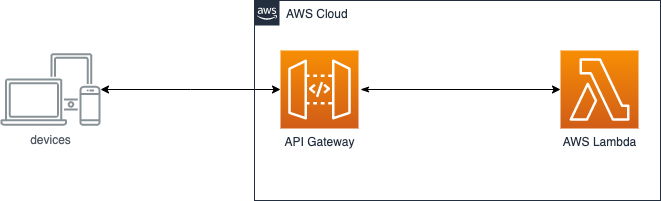
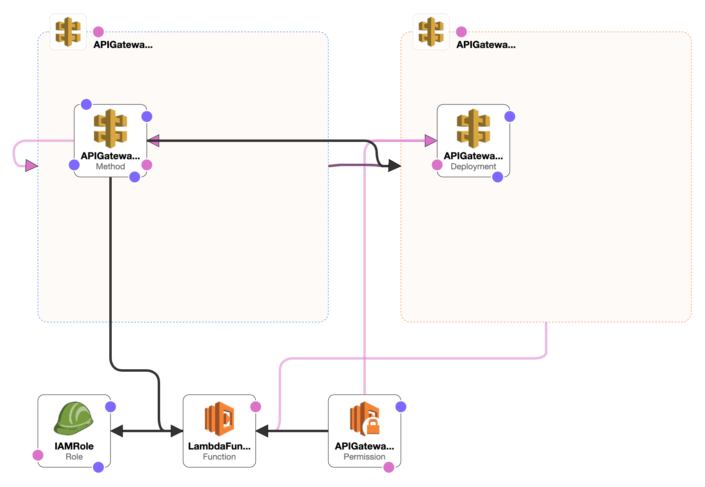

# Sales taxes problem
This problem requires some kind of input to generate sales taxes amount. You are free to implement any mechanism for feeding input into your solution. You should provide sufficient evidence that your solution is complete by, as a minimum, indicating that it works correctly against the supplied data.
## PROBLEM: SALES TAXES
**Basic sales tax** is applicable at a rate of **10%** on all goods, **except** books, food, and medical products that are exempt. **Import duty** is an additional sales tax applicable on all imported goods at a rate of 5%, with no exemptions.
When I purchase items I receive a receipt which lists the name of all the items and their price (including tax), finishing with the total cost of the items, and the total amounts of sales taxes paid. The rounding rules for sales tax are that for a tax rate of n%, a shelf price of p contains (np/100 rounded up to the nearest 0.05) amount of sales tax.
Write an application that prints out the receipt details for these shopping baskets...


## Application Architecture
For resolve this problem I used as cloud provider AWS.
the application architecture uses the following services: 
- AWS API Gateway: a fully managed service that allows you to easily publish, create, maintain, monitor, and secure your API. With this service I created a REST API which interfaces with the other service
- AWS Lambda: is a service that allow you to develop serverless application. This service is triggered by the API call. When receive an API call compute the message and send back the result. The application's core is a python script.
 

## How it works
To use the application, you can use this [endpoint](https://xn37574vlj.execute-api.us-east-2.amazonaws.com/Prod/lambda_sales-taxes-calculator)
The application works if you send a post and set the body with a JSON like this:
```
{
    "items": [
        {
            "product": "chocolates",
            "qty": 1,
            "price": 10.00,
            "specialproduct": true,
            "imported": true
        },
        {
            "product": "perfume",
            "qty": 1,
            "price": 47.50,
            "specialproduct": false,
            "imported": true
        }
    ]
}
```
At this point the AWS Lambda compute the JSON and send back a response like this:
```
{
    "statusCode": 200,
    "body": {
        "items": [
            {
                "product": "chocolates",
                "qty": 1,
                "price": 10.5,
                "specialproduct": true,
                "imported": true
            },
            {
                "product": "perfume",
                "qty": 1,
                "price": 54.65,
                "specialproduct": false,
                "imported": true
            }
        ],
        "SalesTaxes": 7.65,
        "Total": 65.15
    }
}
```
### Infrastructure as Code
The cloud infrastructure is build with the service CloudFormation. 

All services needed by the application are contained inside the script file **buildspec.yml**

The output of this file is represented graphically by the following diagram:


To the Lambda is attached to the **IAMRole** that also is attached to the APIGateway. 